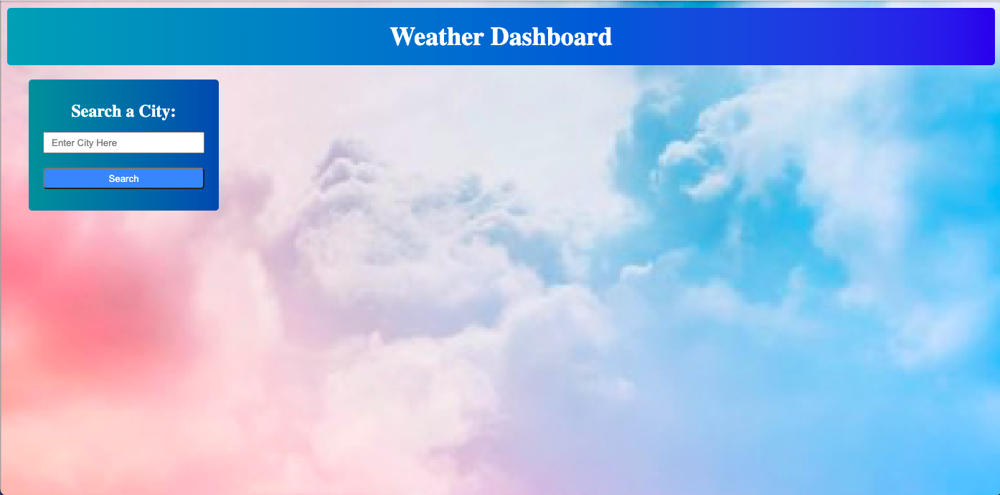

# weather-dashboard
WHEN I search a city
THEN I get then I get the current day's forecast and a 5 day forecast
WHEN I read the current forecast
THEN I have the city name, date, temperature, humidity, wind speed, and UV index
WHEN I read the 5 day forecast
THEN I have the city name, date, temperature, humidity, and wind speed
WHEN I search a ciity
THEN the city is saved under the seach button
WHEN I click on my previously searched cities
THEN it's current and 5 day forecast reappear

## Deployed Site
https://mbrunostem.github.io/weather-dashboard/

